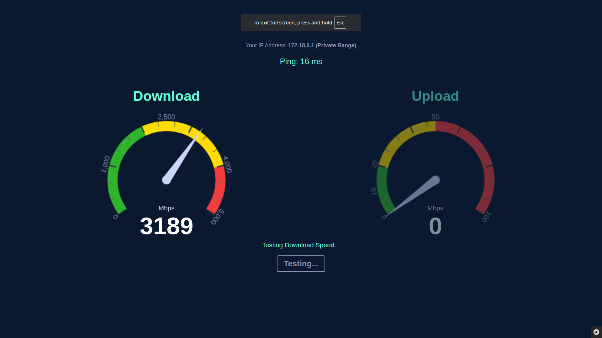

# Speed Test
Simple website for testing internet speed

## Preview


## Installation - Development
1. Clone the repository
2. Run with docker compose (scripts/docker-start-dev.sh)

## Installation - Production
1. Clone this repository
2. Install dependencies ``npm install && composer install``
3. Build assets ``npm run build``
4. Configure website host [apache-site.conf](./docker/configs/apache-site.conf)

## Installation - Docker
You can build a docker image using the production docker file or use the image available here in github packages.
```yaml
php:
    image: ghcr.io/lukasbecvar/speed-test:latest
    container_name: speed_test_webserver
    restart: always
    volumes:
        - ./.docker/services/log:/var/log
    mem_limit: 2g
    ports:
        - "80:80"
```

## License
This software is licensed under the [MIT license](LICENSE).
